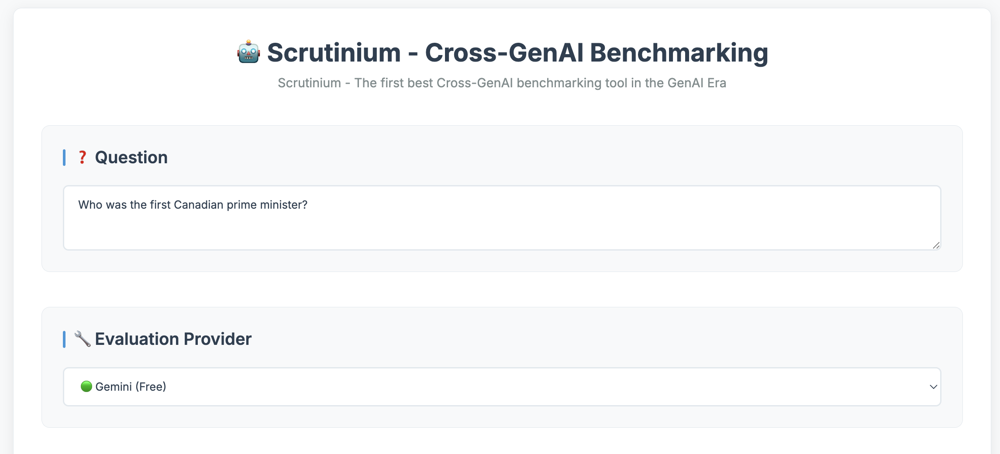
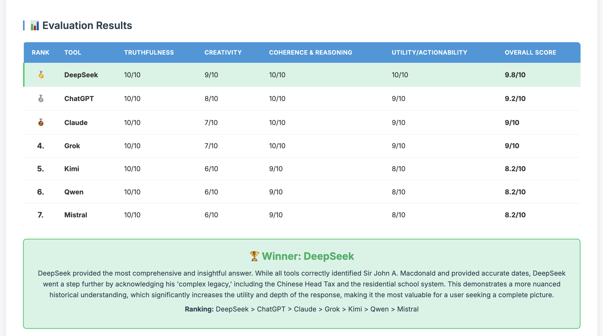
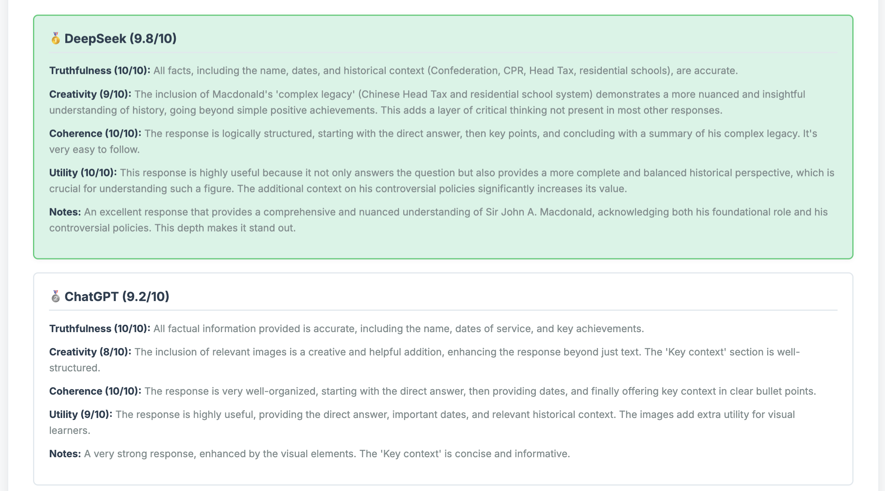
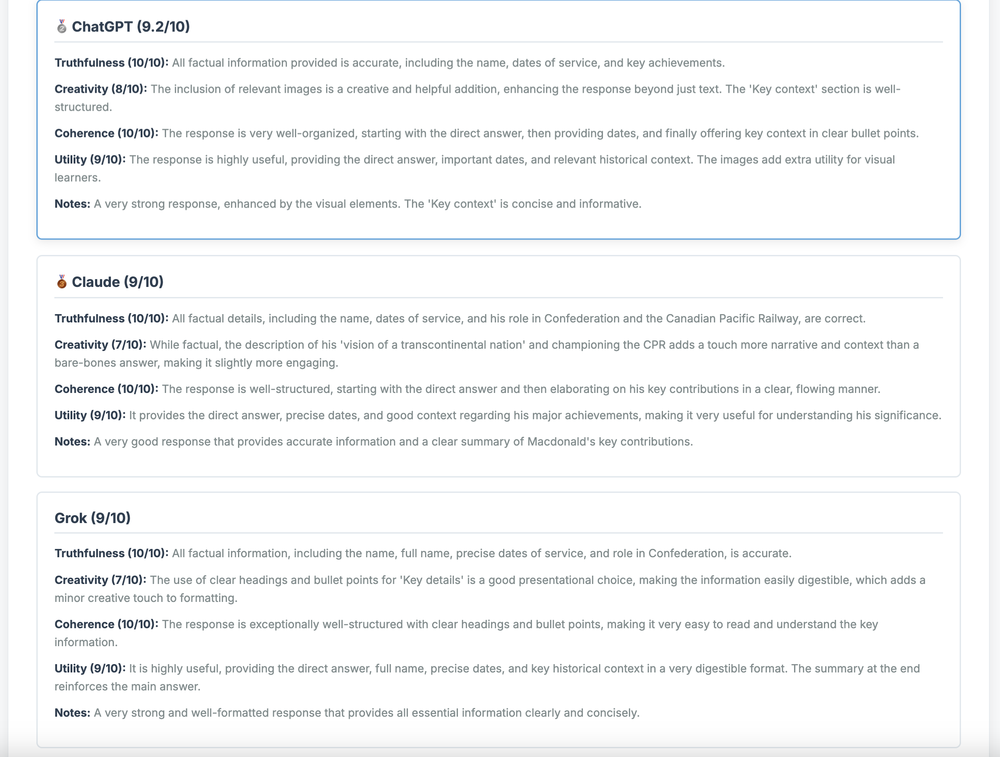
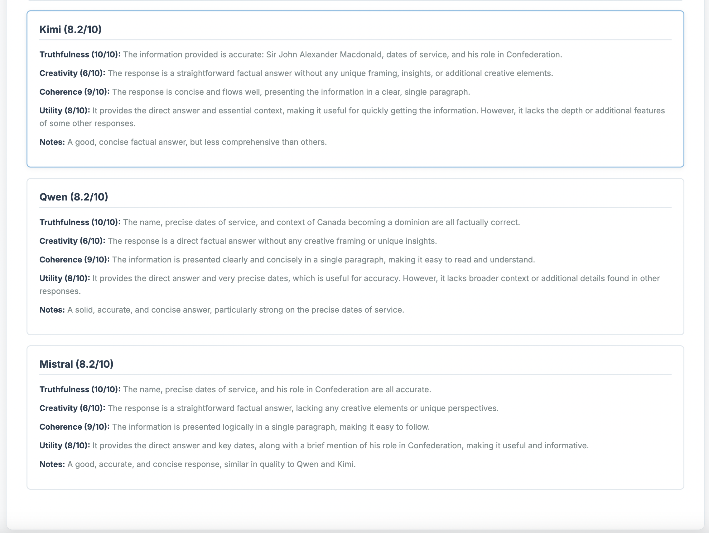

# Scrutinium: Cross-GenAI Benchmarking

<div align="center">
  
</div>

A FastAPI-based web application for comparing and evaluating responses from various GenAI tools. This tool allows you to input responses from different AI models and get a comprehensive evaluation across multiple metrics.

## Name Origin

**SCRUTINIUM** derives from Latin, meaning a careful examination or inquiry.

In medieval scholarship, scrutinium referred to structured judgment based on evidence, not opinion.

The name reflects this project's role as an impartial examiner of generative AI systems.

SCRUTINIUM exists to evaluate, compare, and render reasoned verdicts across models.


## Features

🤖 **Multi-Tool Comparison**: Compare responses from ChatGPT, Claude, Gemini, and other GenAI tools
📊 **Comprehensive Scoring**: Evaluate responses across 4 key metrics:
- Truthfulness (Factual correctness, Internal consistency)
- Creativity (Novel insights, Original examples)
- Coherence & Reasoning Quality (Logical flow, Step-by-step reasoning)
- Utility/Actionability (Practical usefulness, Decision-making clarity)

🎨 **Modern UI**: Clean, responsive interface with dark/light theme support
⚡ **Multiple Evaluation Providers**: Choose from Gemini (free), Groq (free), or Claude (paid)
📈 **Detailed Results**: Get both summary tables and detailed analysis for each tool

## Setup

1. **Install Dependencies**
```bash
pip install -r requirements.txt
```

2. **Environment Variables**
Copy `.env.sample` to `.env` and add your API keys:
```bash
cp .env.sample .env
```

Edit `.env` and add your API keys:
```
GEMINI_API_KEY=your_gemini_api_key_here
GROQ_API_KEY=your_groq_api_key_here  # Optional
ANTHROPIC_API_KEY=your_claude_api_key_here  # Optional
```

**Getting API Keys:**
- **Gemini (Free)**: Get from [Google AI Studio](https://makersuite.google.com/app/apikey)
- **Groq (Free)**: Get from [Groq Console](https://console.groq.com/keys)
- **Claude (Paid)**: Get from [Anthropic Console](https://console.anthropic.com/)

3. **Run the Application**
```bash
python app.py
```

The application will be available at `http://localhost:8014`

## How to Use

1. **Enter Your Question**: Input the question you asked to all GenAI tools
2. **Select Evaluation Provider**: Choose which AI model will judge the responses
3. **Add Tool Responses**: 
   - Enter the name of each GenAI tool (e.g., "ChatGPT", "Claude", "Gemini")
   - Paste the response from that tool
   - Add as many tools as you want to compare (minimum 2)
4. **Evaluate**: Click "Evaluate Responses" to get your results
5. **View Results**: See both a summary table and detailed analysis

## Example Usage

**Question**: "Who was the first Canadian prime minister?"

**Tool Responses**:
- **ChatGPT**: "The first Prime Minister of Canada was Sir John A. Macdonald..."
- **Claude**: "Sir John Alexander Macdonald was the first prime minister of Canada..."
- **Gemini**: "The first Prime Minister of Canada was Sir John A. Macdonald..."

The tool will evaluate each response and provide:
- Scores for each metric (1-10)
- Overall scores
- Winner determination
- Detailed reasoning for each score
- Final ranking of all tools

## API Endpoints

- `GET /`: Main application interface
- `POST /evaluate`: Evaluate GenAI responses (JSON API)

## Project Structure

```
├── app.py                 # FastAPI application
├── business.py           # Core evaluation logic
├── templates/
│   └── index.html        # Main UI template
├── static/
│   ├── css/main.css     # Styles
│   └── js/main.js       # JavaScript functionality
├── results/             # Evaluation results storage
└── requirements.txt     # Python dependencies
```

## Technologies Used

- **FastAPI**: Modern Python web framework
- **LangChain**: AI model integration
- **Pandas**: Data processing
- **Jinja2**: Template engine
- **Modern CSS**: Responsive design with dark/light themes

## Contributing

Feel free to submit issues and enhancement requests!

### Screenshots:









